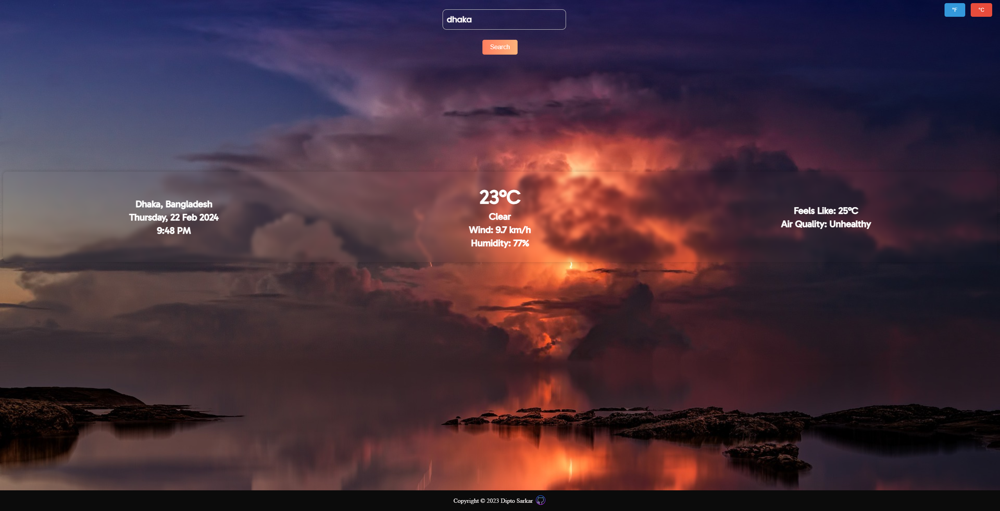

# weatherApp_project
A Weather App Project Using Weather API built with html, css and javascript which shows the weather of any city in the world. It is bundled with webpack.

<a href="https://pixabay.com/photos/thunderstorm-ocean-lightning-3440450/" target="_blank">Image</a> by <a href="https://pixabay.com/users/jplenio-7645255/?utm_source=link-attribution&utm_medium=referral&utm_campaign=image&utm_content=3440450" target="_blank">Joe</a> from <a href="https://pixabay.com//?utm_source=link-attribution&utm_medium=referral&utm_campaign=image&utm_content=3440450" target="_blank">Pixabay</a>

Live Demo: <a href="https://diptosarkar182.github.io/weatherApp_project/">Github</a> and <a href="https://weather-app-project-rouge.vercel.app/">Vercel</a>

## Screenshots



## Installation

1. Clone the repository
2. Install dependencies
   ```sh
   npm install
   ```
3. Create a `.env` file in the root directory and add the following environment variables
   ```sh
    key_number=YOUR_API_KEY
    ```
4. You can get the api key from https://www.weatherapi.com/

5. Install live server extension in vscode
6. Run the project
    ```sh
    npx webpack --watch
    ```
7. Right click on /dist/index.html and click on open with live server

